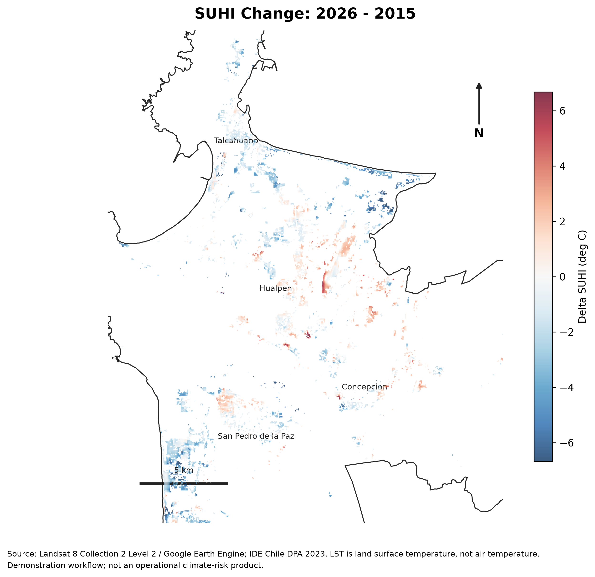
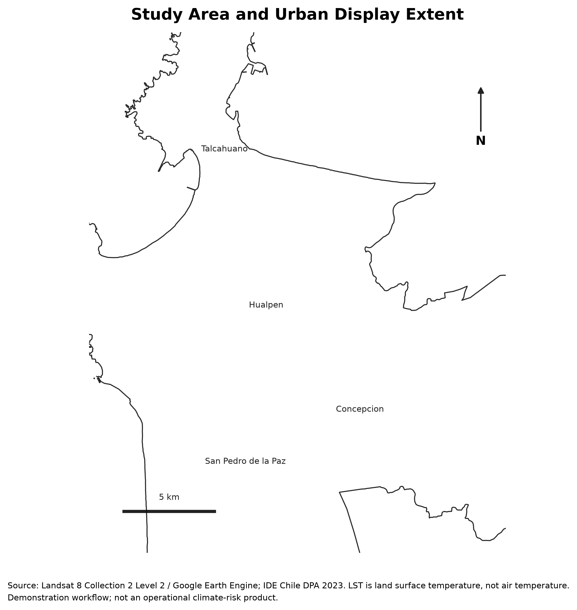
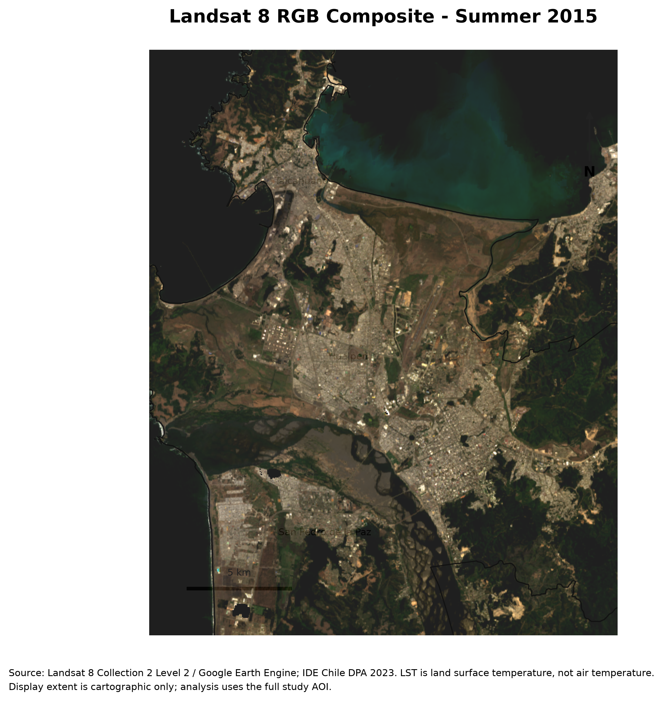
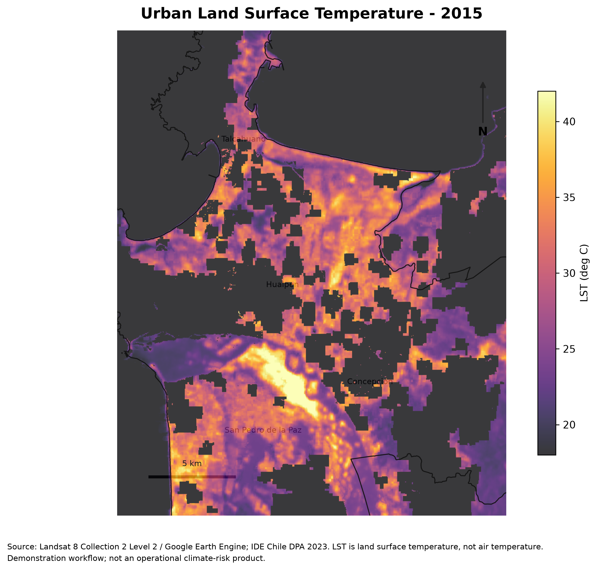
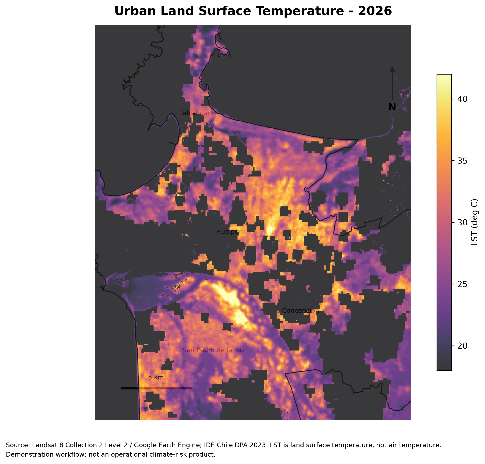
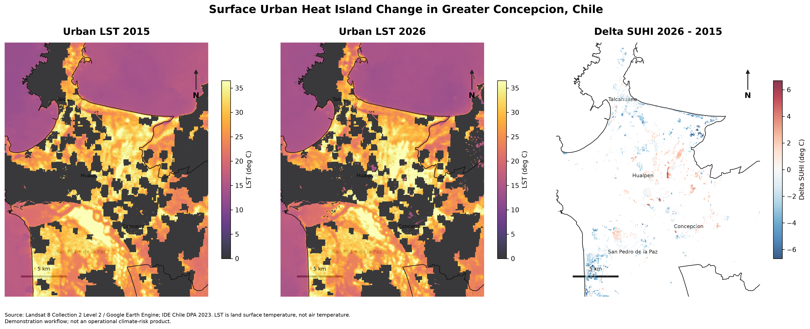

# Mapping Surface Urban Heat Island Change in Greater Concepción, Chile (2015-2026)

[](https://colab.research.google.com/github/geoforestdata/UrbanHeatIsland_GreaterConcepcion/blob/main/UrbanHeatIsland_GreaterConcepcion.ipynb)

This repository maps Surface Urban Heat Island (SUHI) change in Greater Concepción, Chile, between summer 2015 and summer 2026 using Landsat 8 Collection 2 Level 2 imagery, Google Earth Engine, Python, GeoPandas, rasterio, geemap, and cartographic outputs designed for GitHub and public communication.

<p align="center">
  
</p>

<p align="center">
  <a href="https://geoforestdata.github.io/UrbanHeatIsland_GreaterConcepcion/">Open the interactive map</a>
</p>

## Overview

The workflow compares land surface temperature and SUHI intensity for two austral summer periods: January-March 2015 and January-March 2026. SUHI is calculated as urban LST minus a rural reference LST for the same period. The scientific workflow is unchanged from the notebook analysis; the static and interactive maps use a fixed urban-centered display extent only for visualization.

## Google Earth Engine setup

Users need an active Google Earth Engine account to run the notebook. Authentication is handled automatically by the notebook in both Google Colab and local Jupyter.

1. Create or activate a Google Earth Engine account.
2. Open `UrbanHeatIsland_GreaterConcepcion.ipynb`.
3. Run the Google Earth Engine authentication cell.
4. If Earth Engine asks for a Google Cloud project, edit only `EE_PROJECT`.
5. Leave `EE_PROJECT = None` if your account already has a default project.

Most users can leave:

```python
EE_PROJECT = None
```

If Earth Engine requests a Google Cloud project, replace it with your own project ID:

```python
EE_PROJECT = "your-google-cloud-project"
```

No personal project ID is included in this repository.

## Key outputs

<p align="center">
  
  
</p>

<p align="center">
  
  
</p>

<p align="center">
  
</p>

The notebook generates:

- `outputs/figures/Figure_01_Study_Area.png`
- `outputs/figures/Figure_02_RGB_2015.png`
- `outputs/figures/Figure_03_LST_2015.png`
- `outputs/figures/Figure_04_LST_2026.png`
- `outputs/figures/Figure_05_Delta_LST.png`
- `outputs/figures/Figure_06_SUHI_2015.png`
- `outputs/figures/Figure_07_SUHI_2026.png`
- `outputs/figures/Figure_08_Delta_SUHI.png`
- `outputs/figures/Figure_09_Comparison_LST_SUHI.png`
- `docs/index.html`

## Interactive map

Interactive map URL:

https://geoforestdata.github.io/UrbanHeatIsland_GreaterConcepcion/

The interactive map is generated in `docs/index.html` and can be served through GitHub Pages. It includes the study area boundary, LST 2015, LST 2026, Delta LST, SUHI 2015, SUHI 2026, and Delta SUHI. The default visible layer is Delta SUHI 2026 minus 2015.

To enable GitHub Pages:

1. Go to repository Settings.
2. Go to Pages.
3. Set source to Deploy from a branch.
4. Select branch `main`.
5. Select folder `/docs`.
6. Save.

## Workflow

1. Load the official Greater Concepción study-area boundary.
2. Build summer Landsat 8 composites for 2015 and 2026.
3. Apply Landsat Collection 2 Level 2 scale factors.
4. Calculate LST, NDVI, MNDWI, and NDBI.
5. Build spectral-index urban and rural reference masks.
6. Calculate SUHI for 2015 and 2026.
7. Calculate Delta SUHI as SUHI 2026 minus SUHI 2015.
8. Export GeoTIFFs, summary statistics, publication figures, and an interactive HTML map.

## Study area

The analysis uses the local boundary file:

```text
data/admin_boundaries/GreaterConcepcion.shp
```

The boundary is derived from IDE Chile DPA 2023 administrative boundaries and represents the Greater Concepción municipalities of Concepción, Talcahuano, Hualpén, and San Pedro de la Paz. The analysis AOI remains the full study polygon. The map figures use a separate urban-centered display extent so the city and thermal patterns are readable.

## Data sources

- Landsat 8 Collection 2 Level 2 imagery from Google Earth Engine
- Landsat QA_PIXEL quality assessment band for cloud and shadow masking
- IDE Chile DPA 2023 administrative boundaries
- CartoDB Positron basemap for visual context

## Methods

The notebook uses QA_PIXEL cloud masking, Landsat Collection 2 Level 2 scale factors, LST conversion to degrees Celsius, NDVI, MNDWI, NDBI, a spectral-index urban mask, and a spectral-index rural reference mask.

SUHI is calculated as:

```text
SUHI = Urban LST pixel - Mean rural LST reference
```

Delta SUHI is calculated as:

```text
Delta SUHI = SUHI 2026 - SUHI 2015
```

Positive Delta SUHI values indicate increased relative urban heat island intensity. Negative values indicate decreased relative intensity. Landsat LST is land surface temperature, not air temperature.

## Repository structure

```text
UrbanHeatIsland_GreaterConcepcion/
├── README.md
├── UrbanHeatIsland_GreaterConcepcion.ipynb
├── requirements.txt
├── .gitignore
├── LICENSE
├── data/
│   └── admin_boundaries/
│       ├── GreaterConcepcion.shp
│       ├── GreaterConcepcion.dbf
│       ├── GreaterConcepcion.shx
│       ├── GreaterConcepcion.prj
│       └── GreaterConcepcion.cpg
├── outputs/
│   ├── figures/
│   ├── geotiffs/
│   └── tables/
└── docs/
    ├── data_sources.md
    └── index.html
```

## How to run in Colab

1. Open the notebook using the Colab badge above.
2. Confirm the shapefile and companion files are present in `data/admin_boundaries/`.
3. Leave `EE_PROJECT = None` unless Earth Engine asks for a project ID.
4. Run the notebook from top to bottom.
5. Authenticate Google Earth Engine when prompted.
6. Commit the generated PNG files in `outputs/figures/` and `docs/index.html` if publishing on GitHub.

## How to run locally

Create and activate a Python environment, then install the required packages:

```bash
python -m venv .venv
source .venv/bin/activate
pip install -r requirements.txt
jupyter lab
```

You must have access to Google Earth Engine and authenticate when prompted.

If you see:

```text
AttributeError: 'Element' object has no attribute 'select'
```

restart the notebook kernel and rerun from the top. The Landsat preprocessing cell should print:

```text
Landsat preprocessing functions ready. Earth Engine image casting is enabled.
```

## Limitations

This is a demonstration workflow, not an operational climate-risk product. Landsat LST is land surface temperature, not air temperature. SUHI values are relative to the rural reference selected in this workflow.

Results depend on cloud masking, summer date selection, spectral thresholds, rural reference definition, Landsat 30 m spatial resolution, coastal influence, and the selected display extent for communication maps.

## Citation and attribution

Please cite Google Earth Engine, the USGS Landsat 8 Collection 2 Level 2 product, IDE Chile DPA 2023, and CartoDB basemap attribution when using or adapting this workflow.
